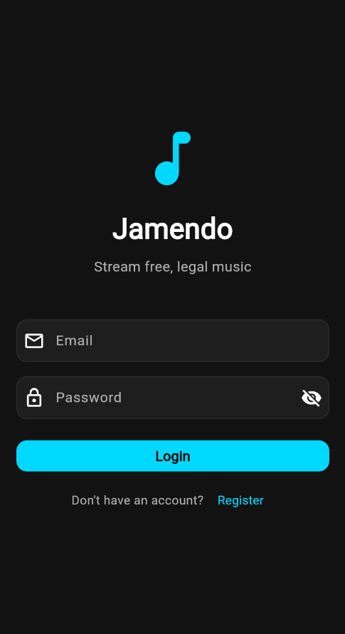
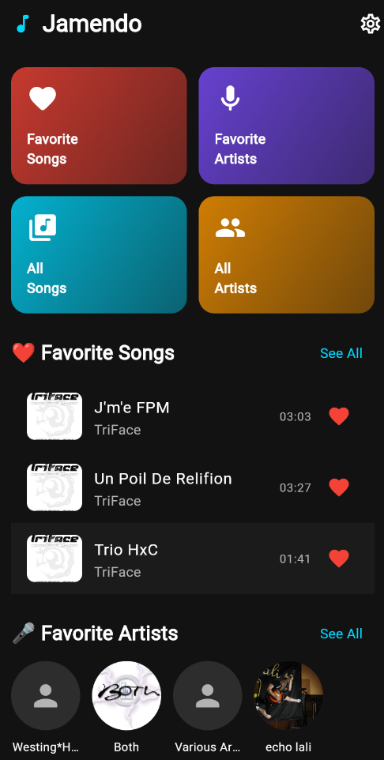
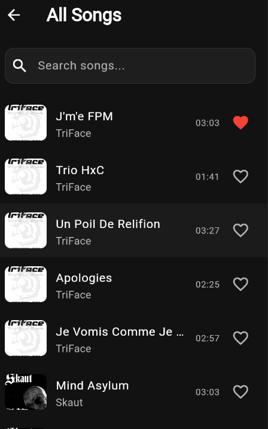
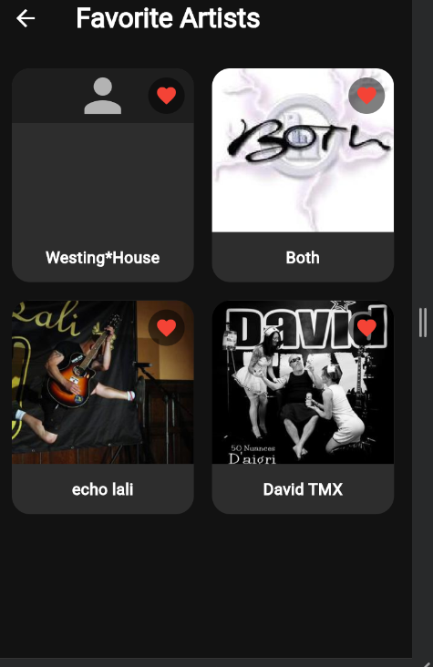
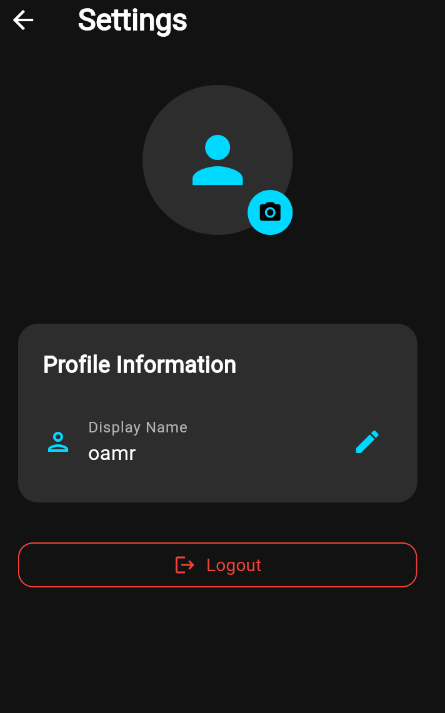
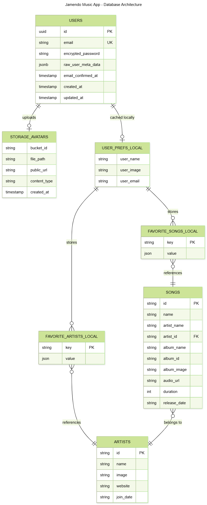

# Jamendo App

A Flutter music streaming application that uses the **Jamendo API** to stream free, legal music. Built with **MVP (Model-View-Presenter)** architecture pattern for clean code separation and testability.


---

## Preview

|          Login           |          Home          |          Songs           |
| :----------------------: | :--------------------: | :----------------------: |
|  |  |  |

|             Favorite Artists             |            Settings            |     Database ERD     |
| :--------------------------------------: | :----------------------------: | :------------------: |
|  |  |  |

---

## Architecture: MVP (Model-View-Presenter)

### Why MVP over MVC?

| Aspect              | MVP                     | MVC                       |
| ------------------- | ----------------------- | ------------------------- |
| **Testing**         | Easy to unit test       | Harder to test            |
| **Separation**      | Clear boundaries        | Controller can grow large |
| **Flutter Fit**     | Works well with widgets | Less natural fit          |
| **Maintainability** | Easy to modify          | Can become messy          |

### Architecture Diagram

```
+---------------------------------------------------------------------+
|                            VIEW LAYER                                |
|         (Flutter Widgets - UI Only, No Business Logic)              |
|  +--------------+  +--------------+  +--------------+               |
|  | LoginPage    |  |  HomePage    |  | SettingsPage |               |
|  |  (Widget)    |  |  (Widget)    |  |  (Widget)    |               |
|  +------+-------+  +------+-------+  +------+-------+               |
+---------|-----------------|-----------------|-----------------------+
          |                 |                 |
          v                 v                 v
+---------------------------------------------------------------------+
|                         PRESENTER LAYER                              |
|              (Controllers - Business Logic & State)                  |
|  +--------------+  +--------------+  +--------------+               |
|  | AuthService  |  | MusicControl |  | SongsControl |               |
|  | (Presenter)  |  | (Presenter)  |  | (Presenter)  |               |
|  +------+-------+  +------+-------+  +------+-------+               |
+---------|-----------------|-----------------|-----------------------+
          |                 |                 |
          v                 v                 v
+---------------------------------------------------------------------+
|                          MODEL LAYER                                 |
|                    (Data & Business Objects)                         |
|  +--------------+  +--------------+  +--------------+               |
|  |    User      |  | ModelSongs   |  |   Artists    |               |
|  |   (Model)    |  |   (Model)    |  |   (Model)    |               |
|  +--------------+  +--------------+  +--------------+               |
+---------------------------------------------------------------------+
          |                 |                 |
          v                 v                 v
+---------------------------------------------------------------------+
|                        DATA LAYER                                    |
|              (Repositories, APIs, Local Storage)                     |
|  +--------------+  +--------------+  +--------------+               |
|  | Supabase     |  | JamendoRepo  |  | FavoritesServ|               |
|  | (Auth)       |  |   (API)      |  | (SharedPrefs)|               |
|  +--------------+  +--------------+  +--------------+               |
+---------------------------------------------------------------------+
```

### Layer Responsibilities

| Layer         | Folder                                        | Responsibility                                        |
| ------------- | --------------------------------------------- | ----------------------------------------------------- |
| **View**      | `lib/widgets/`                                | UI widgets, user interaction, display data            |
| **Presenter** | `lib/controllers/`, `lib/services/`           | Business logic, state management, data transformation |
| **Model**     | `lib/models/`                                 | Data structures, serialization (toJson/fromJson)      |
| **Data**      | `lib/repos/`, `lib/storage/`, `lib/handlers/` | API calls, database, local storage                    |

---

## Project Structure

```
lib/
|-- main.dart                    # App entry point & DI setup
|-- startup.dart                 # Initialization
|
|-- models/                      # MODEL LAYER
|   |-- songs.dart               #    Song data model
|   |-- artist.dart              #    Artist data model
|   |-- playlists.dart           #    Playlist data model
|   +-- user.dart                #    User data model
|
|-- widgets/                     # VIEW LAYER
|   |-- homepage.dart            #    Main home screen
|   |-- login_page.dart          #    Login screen
|   |-- register_page.dart       #    Registration screen
|   |-- artists_page.dart        #    Artists list view
|   |-- favourite_artists.dart   #    Favorite artists section
|   +-- newcontrols.dart         #    Music player controls
|
|-- controllers/                 # PRESENTER LAYER
|   |-- music_controller.dart    #    Audio playback logic
|   |-- songs_controller.dart    #    Songs business logic
|   |-- artist_controller.dart   #    Artists business logic
|   |-- liked_controller.dart    #    Favorites logic
|   +-- api_controller.dart      #    API authentication
|
|-- services/                    # PRESENTER LAYER (Services)
|   |-- auth_service.dart        #    User authentication (Supabase)
|   |-- supabase_config.dart     #    Supabase configuration
|   |-- database_helper.dart     #    Local user storage (SharedPreferences)
|   |-- favorites_service.dart   #    Favorites management
|   +-- storage_service.dart     #    Storage utilities
|
|-- repos/                       # DATA LAYER (Remote)
|   +-- jamendo_repo.dart        #    Jamendo API calls
|
|-- storage/                     # DATA LAYER (Local)
|   |-- songs_helper.dart        #    Songs SharedPreferences
|   +-- artists_helper.dart      #    Artists SharedPreferences
|
|-- handlers/                    # DATA LAYER (Handlers)
|   |-- ihandler.dart            #    Handler interface
|   +-- jamendo_handler.dart     #    Jamendo implementation
|
|-- themes/                      # THEME
|   +-- dark_theme.dart          #    Dark theme configuration
|
+-- helpers/                     # UTILITIES
    |-- mappers.dart             #    Data mappers
    +-- conversions.dart         #    Type conversions
```

---

## UI Design & Colors

### Color Palette (Dark Theme)

| Color              | Hex Code  | Usage                        |
| ------------------ | --------- | ---------------------------- |
| Background         | `#121212` | Main background              |
| Primary (Cyan)     | `#00D9FF` | Buttons, icons, accents      |
| Secondary (Purple) | `#7C4DFF` | Gradients, secondary accents |
| Surface            | `#1E1E1E` | Cards, containers            |
| Card               | `#2D2D2D` | Elevated cards               |
| Text Primary       | `#FFFFFF` | Main text                    |
| Text Secondary     | `#B3B3B3` | Subtitles, hints             |

---

## Features

### 1. Authentication (Supabase)

**View:** Login/Register screens  
**Presenter:** `AuthService` - validates input, manages state  
**Model:** User data  
**Data:** `SupabaseConfig` - Supabase authentication

- Email validation (must be valid format)
- Password validation (minimum 6 characters)
- Supabase cloud authentication
- Session persistence

### 2. Home Page

**View:** `HomePage`, `ArtistsPage`  
**Presenter:** Controllers for each section  
**Model:** `ModelSongs`, `Artists`

- Top Bar with Logo and Settings icon
- Grid navigation boxes:
  - Favorite Songs
  - Favorite Artists
  - All Songs
  - All Artists
- Favorite songs & artists lists

### 3. Settings Page

**View:** `SettingsPage`  
**Presenter:** Profile management logic  
**Data:** SharedPreferences for user preferences

- Profile picture (default avatar, can change)
- Editable display name
- Logout functionality

### 4. Music Streaming

**View:** Player controls, song lists  
**Presenter:** `MusicController`  
**Data:** `JamendoRepo` + `JamendoHandler`

- Jamendo API for free music
- High-quality MP3 streaming
- Like/favorite songs and artists

---

## Data Storage

### Supabase (User Authentication)

Cloud-based authentication using Supabase:

- Email/password authentication
- Session management
- User metadata storage

**Configuration:** `lib/services/supabase_config.dart`

### SharedPreferences (Local Data)

| Key                | Type   | Description         |
| ------------------ | ------ | ------------------- |
| `favorite_songs`   | JSON   | Favorite song IDs   |
| `favorite_artists` | JSON   | Favorite artist IDs |
| `cached_songs`     | JSON   | Cached songs        |
| `cached_artists`   | JSON   | Cached artists      |
| `user_name`        | String | Display name        |
| `user_image`       | String | Profile image path  |
| `users_db`         | JSON   | Local user backup   |

**Files:** `lib/storage/songs_helper.dart`, `lib/services/favorites_service.dart`

---

## Jamendo API

### Get Your Free API Key

1. Go to [Jamendo Developer Portal](https://devportal.jamendo.com/)
2. Create a free account
3. Click "Create Application"
4. Copy your Client ID

### Configuration

Create a `.env` file in the project root (use `.env.example` as template):

```env
JAMENDO_CLIENT_ID=your_client_id_here
```

---

## Getting Started

### Prerequisites

- Flutter SDK 3.10+
- Dart 3.10.4+
- Supabase account (for authentication)

### Installation

```bash
# Clone repository
git clone https://github.com/yourusername/Jamendo-music-app.git
cd Jamendo-music-app

# Install dependencies
flutter pub get

# Run on Chrome (with CORS disabled for web)
flutter run -d chrome --web-browser-flag "--disable-web-security"

# Run on Android/Windows
flutter run -d android
flutter run -d windows
```

### Supabase Setup

1. Create a project at [supabase.com](https://supabase.com)
2. Get your URL and anon key from Project Settings > API
3. Update `lib/services/supabase_config.dart`:

```dart
static const String supabaseUrl = 'YOUR_SUPABASE_URL';
static const String supabaseAnonKey = 'YOUR_ANON_KEY';
```

---

## Theme Configuration

```dart
// lib/themes/dark_theme.dart

const Color primaryCyan = Color(0xFF00D9FF);
const Color secondaryPurple = Color(0xFF7C4DFF);
const Color backgroundDark = Color(0xFF121212);
const Color surfaceDark = Color(0xFF1E1E1E);
const Color cardDark = Color(0xFF2D2D2D);
```

---

## Dependencies

```yaml
dependencies:
  # State Management
  provider: ^6.1.2
  get_it: ^7.7.0
  get_storage: ^2.1.1

  # Audio
  just_audio: ^0.9.46

  # Storage
  shared_preferences: ^2.3.4
  path_provider: ^2.1.5

  # Networking
  http: ^1.4.0

  # Authentication
  supabase_flutter: ^2.12.0

  # UI
  cached_network_image: ^3.4.1
  image_picker: ^1.2.1

  # Security
  crypto: ^3.0.6
```

---

## Troubleshooting

| Issue            | Solution                                                                    |
| ---------------- | --------------------------------------------------------------------------- |
| CORS Error (Web) | Run with `--web-browser-flag "--disable-web-security"`                      |
| API Rate Limit   | Get your own key at [devportal.jamendo.com](https://devportal.jamendo.com/) |
| Auth fails       | Check Supabase credentials and network connection                           |

---

## License

MIT License

---

## Author

Omar Mohamed Farouq
Amr Ashraf Mohamed
Omar Mohamed Ibrahim
Mazen Ismail Mohamed
